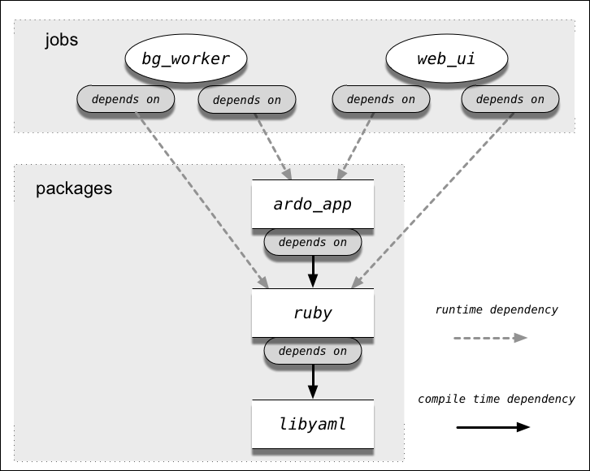

footer: © Matt Curry, 2015
slidenumbers: true
autoscale: true 

![fit] (../common/images/cl_wallpaper9.jpg)

---

# [fit] BOSH Workshop

---

# What is BOSH

- BOSH = BOSH Outter Shell
- Open source tool-chain for release engineering, deployment, and lifecycle management of large scale distributed services.[^1]

[^1]: [http://www.slideshare.net/chanezon/cloud-foundry-bosh-where-the-platform-rubber-meets-the-infrastructure-road-chefconf#27](http://www.slideshare.net/chanezon/cloud-foundry-bosh-where-the-platform-rubber-meets-the-infrastructure-road-chefconf#27)

----

# Concepts

- Packages
- Jobs
- Releases
- Stemcells
- Deployments
- CPI

---

# Many Different Flavors of BOSH

- BOSH Lite - Local development environment for BOSH using containers (Warden) in a Vagrant box.
- Micro-BOSH - Single VM version of BOSH, which is used to deploy a full BOSH cluster.
- BOSH init - Used to create and update the Director in a BOSH environment.  BOSH init replaces micro BOSH.[^2] [^3]

[^2]: [https://blog.starkandwayne.com/2015/04/19/bosh-init-can-deploy-anything-anywhere-anytime/](https://blog.starkandwayne.com/2015/04/19/bosh-init-can-deploy-anything-anywhere-anytime/)


[^3]: [https://bosh.io/docs/migrate-to-bosh-init.html](https://bosh.io/docs/migrate-to-bosh-init.html)

---

# BOSH Components

- BOSH - Full Scale out cluster of BOSH[^4]
  - Director
  - Workers
  - NATS (Messaging)
  - Registry
  - Blobstore
  - Health Monitor
  - DNS Server
  - Postgres

[^4]: [https://bosh.io/docs/bosh-components.html](https://bosh.io/docs/bosh-components.html)

---

# Lab - Prepare the Environment
### We will be installing in a linux environment with 8G of memory and 100G of Disk.

1. Install Vagrant
1. Install Virtualbox
1. Modify the Vagrant File
1. Install Ruby on the vagrant VM
1. Install the BOSH CLI on vagrant VM

---

# Lab 1

- We are going to edit the bosh-sample-release Vagrant file to give us 2 VM's.
- The first VM will be the BOSH CLI and the second VM will be the BOSH Director

---

# Setup

1. Install Vagrant & Virtualbox
  - http://www.vagrantup.com/downloads
1. Install git
  - Mac: Should not have to do anything
  - Windows: https://git-scm.com/download/win
1. Clone bosh-lite repository
  ```bash
  git clone https://github.com/cloudfoundry/bosh-lite
  cd bosh-lite
  ```

---

# Edit the BOSH Lite Vagrantfile

```
Vagrant.configure('2') do |config|
 
   config.vm.define "director" do |director|
     director.vm.box = 'cloudfoundry/bosh-lite'
     director.vm.provider :virtualbox do |v, override|
       override.vm.network :private_network, ip: '192.168.59.4', id: :local
     end
 
   end
 
   config.vm.define "cli" do |cli|
     cli.vm.box = 'ubuntu/trusty64'
     cli.vm.provider :virtualbox do |v, override|
       override.vm.network :private_network, ip: '192.168.59.14', id: :local
     end
   end
 
   config.vm.provider :virtualbox do |v, override|
     override.vm.box_version = '9000.79.0' # ci:replace
     # To use a different IP address for the bosh-lite director, uncomment this line:
     # override.vm.network :private_network, ip: '192.168.59.4', id: :local
   end
 end
```

---

# Login and Install Ruby

```bash
vagrant ssh cli

sudo apt-get update
sudo apt-get install git-core curl zlib1g-dev build-essential \
libssl-dev libreadline-dev libyaml-dev libsqlite3-dev sqlite3 \
libxml2-dev libxslt1-dev libcurl4-openssl-dev \
python-software-properties libffi-dev tree
#Then install rbenv, which is used to install Ruby:

git clone https://github.com/sstephenson/rbenv.git .rbenv
echo 'export PATH="$HOME/.rbenv/bin:$PATH"' >> ~/.bashrc
echo 'eval "$(rbenv init -)"' >> ~/.bashrc
exec $SHELL

git clone https://github.com/sstephenson/ruby-build.git ~/.rbenv/plugins/ruby-build
echo 'export PATH="$HOME/.rbenv/plugins/ruby-build/bin:$PATH"' >> ~/.bashrc
exec $SHELL

rbenv install 2.2.0
rbenv global 2.2.0
ruby -v

```

---

Install the BOSH CLI

```bash
$ gem install bosh_cli --no-ri --no-rdoc
```

Target the BOSH Director
```bash
$ bosh target 192.168.59.4 lite
Target set to 'Bosh Lite Director'
$ bosh login
Your username: admin
Enter password:
Logged in as 'admin'
```

---

Add Network Route from your computer (Not from CLI)

```bash
$ bin/add-route
+ old_ips=10.244.0.0/19
+ ips=10.244.0.0/16
+ gw=192.168.50.4
+ echo 'Adding the following route entry to your local route 
table to enable direct container access: 10.244.0.0/16 via 
192.168.50.4. Your sudo password may be required.'
++ uname
+ '[' Darwin = Darwin ']'
+ sudo route delete -net 10.244.0.0/19 192.168.50.4
Password:
route: writing to routing socket: not in table
delete net 10.244.0.0: gateway 192.168.50.4: not in table
+ sudo route delete -net 10.244.0.0/16 192.168.50.4
route: writing to routing socket: not in table
delete net 10.244.0.0: gateway 192.168.50.4: not in table
+ sudo route add -net 10.244.0.0/16 192.168.50.4
add net 10.244.0.0: gateway 192.168.50.4
```

---

Create a stubbed release from CLI VM

```bash
$ vagrant ssh cli
$ mkdir workspace
$ cd workspace
$ bosh init release bosh-sample-release
$ tree bosh-sample-release
bosh-sample-release
├── blobs
├── config
│   └── blobs.yml
├── jobs
├── packages
└── src
```

---

#[fit] End of Lab 1

---

# Jobs

In order to create a BOSH release you will need to map your existing cloud service into "jobs", the fundamental building block of a BOSH deployment. Essentially this is just creating logical groupings of processes that are organized around providing discrete functionality.


In the case of our sample release, we are implementing an architecture with four easily recognizable roles: a web application (1) sitting behind a proxy (2), leveraging a database server (3) for dynamic content and a shared filesystem (4) for static content.




---

# Jobs

For each job you will need to identify:

- processes that need to run
- packages that are required for running these processes
- package dependencies (e.g. libraries)

One of the best ways to think of a job is that it is a part of the architecture that can independently be stopped or started.

---

# Jobs

- wordpress (web application)
- nginx (proxy)
- mysql (db)
- nfs server (shared filesystem)

---

# Packages

Each Job is compozed of one or more packages.

- *wordpress (web application)*
  - **apache**
  - **wordpress ( PHP code )**
  - **mysql client**
- *nginx (proxy)*
  - **nginx**
- *mysql (db)*
  - **mysql**
- *nfs server (shared filesystem)*
  - **nfs server**

---

# Generate apache2 package skeleton

```bash
$ cd bosh-sample-release
$ bosh generate package apache2
create  packages/apache2
create  packages/apache2/packaging
create  packages/apache2/pre_packaging
create  packages/apache2/spec

Generated skeleton for 'apache2' package in 'packages/apache2'
```

---

# Define the spec file

The spec file is a yaml document that lists the names of the required source files and other packages which are compilation dependencies.

**packages/apache2/spec**

```
---

name: apache2

files:
  - apache2/httpd-2.2.25.tar.gz
```

---

# Copy the source into the package


You'll notice that the location of the source in the package spec is a relative path. This is because the file can either be a part of the repo (inside the src directory) or stored in the blobstore (synched to blobs directory). In the case of our sample release we're storing source in the repo:

From the sample release base directory:

```bash
$ mkdir -p src/apache2
$ tree
.
├── blobs
├── config
│   └── blobs.yml
├── jobs
├── packages
│   └── apache2
│       ├── packaging
│       ├── pre_packaging
│       └── spec
└── src
    └── apache2

7 directories, 4 files
```

---

# Grab the source bundle for apache

```bash
$ cd src/apache2
$ wget 'http://apache.tradebit.com/pub/httpd/httpd-2.2.25.tar.gz'
--2015-12-01 23:05:37--  http://apache.tradebit.com/pub/httpd/httpd-2.2.25.tar.gz
Resolving apache.tradebit.com... 66.11.12.100
Connecting to apache.tradebit.com|66.11.12.100|:80... connected.
HTTP request sent, awaiting response... 301 Moved Permanently
Location: http://www.tradebit.com/ [following]
--2015-12-01 23:05:39--  http://www.tradebit.com/
Resolving www.tradebit.com... 169.53.240.164
Connecting to www.tradebit.com|169.53.240.164|:80... connected.
HTTP request sent, awaiting response... 200 OK
Length: unspecified [text/html]
Saving to: 'httpd-2.2.25.tar.gz'

httpd-2.2.25.tar     [ <=>        ]  37.55K  --.-KB/s   in 0.09s

2015-12-01 23:05:40 (436 KB/s) - 'httpd-2.2.25.tar.gz' saved [38449]
```

---

# Write compilation script

**Environmentals**
- BOSH_COMPILE_TARGET = The current working directory (where the source is).
- BOSH_INSTALL_TARGET = Where the package will be installed

**packages/apache2/packaging**

```bash
echo "Extracting apache https..."
tar xzf apache2/httpd-2.2.25.tar.gz

echo "Building apache https..."
(
    cd httpd-2.2.25
    ./configure \
    --prefix=${BOSH_INSTALL_TARGET} \
    --enable-so
    make
    make install
)
```

---

# Summary

##What did we just do?

1. Generated the package skeleton for apache with `bosh generate package ...` 
1. Edited the spec file to add the source bundle location
1. Create directory for source code
1. Download source from the internet
1. Write the compilation script

---

# Lab 2 - Build the packages

For the rest of the packages, generate the skeleton, edit the spec file, add the source, and write a compilation script.

To get you started:

```bash
$ echo common debian_nfs_server mysql mysqlclient nginx php5 wordpress | xargs -n1 bosh generate package
```

---

Package List:

- common - This contains a script to enable wordpress to use nfs for multi-node support
- debian_nfs_server - debian package to install NFS.
- mysql - installs mysql server
- mysqlclient - installs the mysql client for apache and php
- nginx - installs nginx proxy
- php5 - installs the php module for apache
- wordpress - installs wordpress source code

---

# Spec file for PHP

**packages/php5/spec**

```
---
name: php5

dependencies:
  - apache2
  - mysqlclient

files:
  - php5/php-5.3.27.tar.gz
```

---

# Compile script for PHP

**packages/php5/packaging**

```bash
echo "Extracting php5..."
tar xjf php5/php-5.3.27.tar.bz2

# ./configure needs the location of the apache and mysql packages
export APACHE2=/var/vcap/packages/apache2

echo "Building php5..."
cd php-5.3.27
  ./configure \
  --prefix=${BOSH_INSTALL_TARGET} \
  --with-apxs2=${APACHE2}/bin/apxs \
  --with-config-file-path=/var/vcap/jobs/wordpress/config/php.ini \
  --with-mysql=/var/vcap/packages/mysqlclient

# the output of make is too large for the message bus, so send to /dev/null
make > /dev/null
make install > /dev/null

# make install copies the module to the apache module directory.  
# We have to copy it back into BOSH_INSTALL_TARGET otherwise it will be left behind
mkdir -p ${BOSH_INSTALL_TARGET}/modules
cp ${APACHE2}/modules/libphp5.so ${BOSH_INSTALL_TARGET}/modules
```

----

# Add the source for PHP

From the bosh-sample-release directory:

```bash
mkdir -p src/php5
cd src/php5
wget http://www.php.net/distributions/php-5.3.27.tar.gz
```

---

```bash
$ tree
.
├── blobs
├── config
│   └── blobs.yml
├── jobs
├── packages
│   ├── apache2
│   │   ├── packaging
│   │   ├── pre_packaging
│   │   └── spec
│   ├── common
│   │   ├── packaging
│   │   ├── pre_packaging
│   │   └── spec
│   ├── debian_nfs_server
│   │   ├── packaging
│   │   ├── pre_packaging
│   │   └── spec
│   ├── mysql
│   │   ├── packaging
│   │   ├── pre_packaging
│   │   └── spec
│   ├── mysqlclient
│   │   ├── packaging
│   │   ├── pre_packaging
│   │   └── spec
│   ├── nginx
│   │   ├── packaging
│   │   ├── pre_packaging
│   │   └── spec
│   ├── php5
│   │   ├── packaging
│   │   ├── pre_packaging
│   │   └── spec
│   └── wordpress
│       ├── packaging
│       ├── pre_packaging
│       └── spec
└── src
    ├── apache2
    │   └── httpd-2.2.25.tar.gz
    └── php5
        └── php-5.3.27.tar.gz

15 directories, 27 files
```

---

#Lab 3 - Finish the rest of the spec and packaging files and get the source downloaded

---

# Source Locations:
## Create folders for common, debian_nfs_server, mysql, nginx, php5, wordpress

- php5 (Should be done already)  
  - http://www.php.net/distributions/php-5.3.27.tar.gz
- common 
  - https://raw.githubusercontent.com/cloudfoundry/bosh-sample-release/master/src/common/utils.sh
- debian_nfs_server 
  - http://launchpadlibrarian.net/62531905/nfs-kernel-server_1.2.0-4ubuntu4.1_amd64.deb

---

# Source Files

- nginx 
  - http://nginx.org/download/nginx-1.0.11.tar.gz
  - https://github.com/vkholodkov/nginx-upload-module/archive/2.2.0.tar.gz (nginx_upload_module-2.2.0.tar.gz) 
  - http://downloads.sourceforge.net/project/pcre/pcre/8.21/pcre-8.21.tar.gz?r=http%3A%2F%2Fsourceforge.net%2Fprojects%2Fpcre%2Ffiles%2Fpcre%2F8.21%2F&ts=1449120102&use_mirror=superb-dca2 (pcre-8.21.tar.gz)
  - https://github.com/cloudfoundry/bosh-sample-release/blob/master/src/nginx/upload_module_put_support.patch
  - https://github.com/openresty/headers-more-nginx-module/archive/v0.15rc1.tar.gz (headers-more-v0.15rc1.tgz)

---

# Source Files

- mysql
  - https://github.com/cloudfoundry/bosh-sample-release/raw/master/src/mysql/client-5.1.54-rel12.5-188-Linux-x86_64.tar.gz
  - https://raw.githubusercontent.com/cloudfoundry/bosh-sample-release/master/src/mysql/mysql.server
  - https://github.com/cloudfoundry/bosh-sample-release/raw/master/src/mysql/server-5.1.54-rel12.5-188-Linux-x86_64.tar.gz

- wordpress
  - https://wordpress.org/wordpress-3.5.2.tar.gz (wordpress-3.5.2.tgz)

---

# Spec Files

- common
  - https://raw.githubusercontent.com/cloudfoundry/bosh-sample-release/master/packages/common/spec
- debian_nfs_server
  - https://raw.githubusercontent.com/cloudfoundry/bosh-sample-release/master/packages/debian_nfs_server/spec
  - You will need to modify the package name of the artifcat in the spec file to be nfs-kernel-server_1.2.0-4ubuntu4.1_amd64.deb
- mysql
  - https://github.com/cloudfoundry/bosh-sample-release/blob/master/packages/mysql/spec
- mysqlclient
  - https://raw.githubusercontent.com/cloudfoundry/bosh-sample-release/master/packages/mysqlclient/spec
- nginx
  - https://raw.githubusercontent.com/cloudfoundry/bosh-sample-release/master/packages/nginx/spec
- wordpress
  - https://raw.githubusercontent.com/cloudfoundry/bosh-sample-release/master/packages/wordpress/spec

---

# Packaging Files (Install Scripts)

- common
  - https://raw.githubusercontent.com/cloudfoundry/bosh-sample-release/master/packages/common/packaging
- debian_nfs_server
  - https://raw.githubusercontent.com/cloudfoundry/bosh-sample-release/master/packages/debian_nfs_server/packaging
- mysql
  - https://github.com/cloudfoundry/bosh-sample-release/blob/master/packages/mysql/packaging
- mysqlclient
  - https://raw.githubusercontent.com/cloudfoundry/bosh-sample-release/master/packages/mysqlclient/packaging
- nginx
  - https://raw.githubusercontent.com/cloudfoundry/bosh-sample-release/master/packages/nginx/packaging
- wordpress
  - https://raw.githubusercontent.com/cloudfoundry/bosh-sample-release/master/packages/wordpress/packaging

---

# [fit] End Lab 3

---

# What is a Job?

Jobs are a realization of packages, i.e. running one or more processes from a package. A job contains the configuration files and startup scripts to run the binaries from a package.

---

##Lifecycle of a BOSH Job

There are several stages that each release job goes through during a deployment process:

1. release job and its dependent packages are downloaded and placed on a machine
1. __*pre-start scripts*__ run for all release jobs
  - (waits for all pre-start scripts to finish)
1. `monit start` is called for each process
1. monit will automatically restart processes that exited
1. monit unmonitor is called for each process
  - (waits for all pre-start scripts to finish)
1. __*drain scripts*__ run for all release jobs
  - (waits for all pre-start scripts to finish)
1. `monit stop` is called for each process

---

# Generate job skeleton

From the bosh-sample-release folder: 

```bash
$ bosh generate job wordpress
create  jobs/wordpress
create  jobs/wordpress/templates
create  jobs/wordpress/spec
create  jobs/wordpress/monit

Generated skeleton for 'wordpress' job in 'jobs/wordpress'
```

---

#Job Spec File

Defines:
- required packages
- paths to the configuration templates
- job properties (plus descriptions and defaults) used by the templates

---

# Nginx Spec File

**jobs/nginx/spec**

```
---
name: nginx

templates:
  nginx_ctl:      bin/nginx_ctl
  nginx.conf.erb: config/nginx.conf
  mime.types:     config/mime.types

packages:
  - nginx

properties:
  nginx.workers:
    description: Number of nginx worker processes
    default: 1
  wordpress.servername:
    description: Name of the virtual server
  wordpress.port:
    description: TCP port upstream (backends) servers listen on
    default: 8008
  wordpress.servers:
    description: Array of upstream (backends) servers
```

---

# Wordpress Spec File

Step 1: add the packages

**jobs/wordpress/spec**

```
---
name: wordpress

templates: {}

packages:      
  - mysqlclient
  - apache2
  - php5
  - wordpress   
```

---

# What the crap is a template?

The templates directory contains the scripts and config files needed for running the job processes. BOSH evaluates these files as ruby ERB templates, allowing them to be generalized. The unique per-deployment information can then be abstracted into properties defined in the deployment manifest.

When converting existing files/scripts to work on a BOSH managed instance, the most common modifications are usually changing paths to the appropriate location on a BOSH managed system.

---

# BOSH Paths

- package contents
  - /var/vcap/package/{package name}
- job configuration files
  - /var/vcap/jobs/{job name}/config
- control scripts
  - /var/vcap/jobs/{job name}/bin
- pidfiles
  - /var/vcap/sys/run
- log storage
  - /var/vcap/sys/log/{process name}
- persistent data storage
  - /var/vcap/store  

---

# Template example apache - httpd.conf

Create an `httpd.conf.erb` file in the templates folder

- Set the document root to be the location of the wordpress package
```
DocumentRoot "/var/vcap/packages/wordpress"
```

-  Set appropriate log locations:
```
ErrorLog "/var/vcap/sys/log/apache2/error_log"
CustomLog "/var/vcap/sys/log/apache2/access_log" common
```

---

# Add the new template to the spec file

```
---
name: wordpress

templates: 
  httpd.conf.erb:     config/httpd.conf

packages:      
  - mysqlclient
  - apache2
  - php5
  - wordpress   
```

---

# Job Properties

Job properties allow us to pull configuration values from the BOSH manifest into the application configuration values.

To reference a job property in a ERB template, use the "p" helper, e.g.:

**jobs/wordpress/templates/wp-config.php.erb**

```ruby
define('AUTH_KEY',         '<%= p("wordpress.auth_key") %>');
define('SECURE_AUTH_KEY',  '<%= p("wordpress.secure_auth_key") %>');
define('LOGGED_IN_KEY',    '<%= p("wordpress.logged_in_key") %>');
define('NONCE_KEY',        '<%= p("wordpress.nonce_key") %>');
define('AUTH_SALT',        '<%= p("wordpress.auth_salt") %>');
define('SECURE_AUTH_SALT', '<%= p("wordpress.secure_auth_salt") %>');
define('LOGGED_IN_SALT',   '<%= p("wordpress.logged_in_salt") %>');
define('NONCE_SALT',       '<%= p("wordpress.nonce_salt") %>');
```

---

# Add job properties to the spec file

All job properties need to be defined in the spec file with names and descriptions

```
  wordpress.auth_key:
    description: Wordpress Authentication Unique Keys (AUTH_KEY)
  wordpress.secure_auth_key:
    description: Wordpress Authentication Unique Keys (SECURE_AUTH_KEY)
  wordpress.logged_in_key:
    description: Wordpress Authentication Unique Keys (LOGGED_IN_KEY)
  wordpress.nonce_key:
    description: Wordpress Authentication Unique Keys (NONCE_KEY)
  wordpress.auth_salt:
    description: Wordpress Authentication Unique Salts (AUTH_SALT)
  wordpress.secure_auth_salt:
    description: Wordpress Authentication Unique Salts (SECURE_AUTH_SALT)
  wordpress.logged_in_salt:
    description: Wordpress Authentication Unique Salts (LOGGED_IN_SALT)
  wordpress.nonce_salt:
    description: Wordpress Authentication Unique Upload the stemcells
```

---

# Review of what we did

1. Create job skeleton
1. Add the packages to the `spec` file 
1. Update paths in the templates and add the template to the spec file
1. Add job properties to the templates
1. Add job property definitions to the `spec` file

---

# Monit Config

BOSH uses monit to manage the lifecycle of job processes. At a bare minimum the monit config file inside the job directory needs to define:

- pidfile 
- how to start/stop the job 

---

# Creating a stub monit config:

**jobs/wordpress/monit**

```
check process wordpress
  with pidfile /var/vcap/sys/run/apache2/httpd.pid
  start program "/var/vcap/jobs/wordpress/bin/wordpress_ctl start" with timeout 60 seconds
  stop program "/var/vcap/jobs/wordpress/bin/wordpress_ctl stop" with timeout 60 seconds
  group vcap
```

---

# [fit] Lab 4 - Complete filling out the jobs

---

# List of Spec Files

- debian_nfs_server
  - https://raw.githubusercontent.com/cloudfoundry/bosh-sample-release/master/jobs/debian_nfs_server/spec
- mysql
  - https://raw.githubusercontent.com/cloudfoundry/bosh-sample-release/master/jobs/mysql/spec 
- nginx
  - https://raw.githubusercontent.com/cloudfoundry/bosh-sample-release/master/jobs/nginx/spec
- wordpress
  - https://raw.githubusercontent.com/cloudfoundry/bosh-sample-release/master/jobs/wordpress/spec

---

# List of Monit File

- debian_nfs_server
  - https://raw.githubusercontent.com/cloudfoundry/bosh-sample-release/master/jobs/debian_nfs_server/monit
- mysql
  - https://raw.githubusercontent.com/cloudfoundry/bosh-sample-release/master/jobs/mysql/monit 
- nginx
  - https://raw.githubusercontent.com/cloudfoundry/bosh-sample-release/master/jobs/nginx/monit
- wordpress
  - https://raw.githubusercontent.com/cloudfoundry/bosh-sample-release/master/jobs/wordpress/monit

---

#Template folder contents

- debian_nfs_server
  - https://github.com/cloudfoundry/bosh-sample-release/tree/master/jobs/debian_nfs_server/templates
- mysql
  - https://github.com/cloudfoundry/bosh-sample-release/tree/master/jobs/mysql/templates
- nginx
  - https://github.com/cloudfoundry/bosh-sample-release/tree/master/jobs/nginx/templates
- wordpress
  - https://github.com/cloudfoundry/bosh-sample-release/tree/master/jobs/wordpress/templates

---

What is so special about a _clt script?

---

# [fit] End of Lab 4

--- 

# Config the blobstore
###What is it and why is it important?

---

# Create a deployment manifest

- Example deployment manifest:
  - https://raw.githubusercontent.com/cloudfoundry/bosh-sample-release/master/examples/wordpress-warden.yml
- Edit the stemcell name:
    - bosh-warden-boshlite-ubuntu-trusty-go_agent

You must replace the director UUID.  You can get it by running the following command:

```bash
$ bosh status
```

---

# [fit] bosh create release

---

# [fit] bosh upload release

---

# [fit] Upload the stemcells

- vagrant plugin install vagrant-scp
- vagrant scp bosh-stemcell-389-warden-boshlite-ubuntu-trusty-go_agent.tgz cli:~/
- bosh upload stemcell bosh-stemcell-389-warden-boshlite-ubuntu-trusty-go_agent.tgz

---

# [fit] bosh deployment wordpress-warden.yml
- wget https://raw.githubusercontent.com/cloudfoundry/bosh-sample-release/master/examples/wordpress-warden.yml
- Remember to update the directory UUID.  

---

# [fit] bosh deploy

---

# [fit] bosh vms

---

# [fit] Do a BOSH deploy
