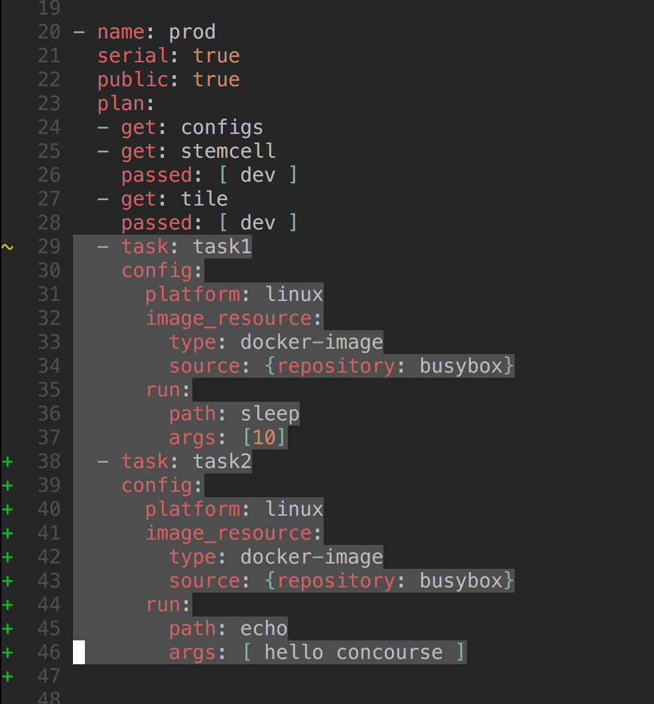

footer: © Matt Curry & Alan Moran, 2016
slidenumbers: true
autoscale: true 

![fit] (../common/images/cl_wallpaper9.jpg)

---

# [fit] Untangling Platform Complexity 
# with Concourse CI

---

 

  
Matt Curry
Director of Cloud Engineering
Allstate
@mattjcurry

        
Alan Moran
Cloud Foundry Architect
Allstate
@bonzofenix

---

# Summary

- Product mindset drives an automation heavy culture
- We iterated our way to success
- We have created engineering capacity through automation
- You can do it too!

---

# [fit] Culture

---

# Platform as a Product

  - Customer
      - Developers 
  - Problem
      - Too much time on non-business value added work
  - Solution
      - Connected Platform
      - Minimize the operational burdon of running apps

---

# The Starting Point

  - 3 full time engineers
  - 3 Cloud Foundry Foundations
  - Several tiles (Mobile push, mySQL, Redis)
  - No production environment
  - Manual upgrades of the platform

---

# Too Much Time Maintaining CF

- Basically 100% of engineering time
  - Tiles broke frequently (Upgrade order matters)
    - e.g. RabbitMQ must be upgraded before mobile push
  - Lack of consistency

---

![fit] (../common/images/tile_dependencies.png)

---

![fit] (../common/images/agile_manifesto.png)

---

# Our Initial Goals

  - Reduce the operational burden of running and scaling the platform.
    - Ensure that our CF environments look consistent
    - Automate testing of platform components
  - Have a reliable way to recover in case of failure
    - Ensure environments can be reproduced from source control
  - Automate Everything
    - No more #@$*^$ GUI's.

---

> Releasing software should be easy. It should be easy because you have tested every single part of the release process hundreds of times before. It should be as simple as pressing a button. The repeatability and reliability derive from two principles: automate almost everything, and keep everything you need to build, deploy, test, and release your application in version control.
-- David Farley, Continuous Delivery: Reliable Software Releases through Build, Test, and Deployment Automation

---

---

## Concourse resources
> any entity that can be checked for new versions, pulled down at a specific version, and/or pushed up to idempotently create new versions 
-- concourse.ci

---

## Concourse jobs
> Some actions to perform when dependent resources change (or when manually triggered)
-- concourse.ci

---

## Concourse tasks
> the execution of a script in an isolated environment with dependent resources available to it
-- concourse.ci

---

# Basic pipeline pattern

---

# Basic pipeline pattern

---

# Basic pipeline pattern

---

# Multi-environment pipeline

---

# Multi-environment pipeline

---

# Multi-environment pipeline

---

# Multi-environment pipeline

---

# Multi-environment pipeline

---

![original] (../common/images/journey.jpg)

# [fit] The Journey

---

## First Iteration

- Concourse tasks instead of resources to manage:
  * Tiles
  * Ops Manager
  * Stemcells
- Needed to vendor components into internal artifact repository
- Let concourse git resource manage configurations
- Concourse bash task to deploy ops manager appliance 
- Concourse bash task to deploy using experimental ops manager api 

---

### Single pipeline to rule them all 

---

# Benefits

- Codified tile dependencies
- Each environment was perfectly consistent
- New environment provisioning went from 1 week to 8 hours
- Engineering time for a deployment went from 40 hours to 3 hours

---

# Opportunities

- Concourse pipeline definition file was large, complex and repetitive (2-3K Lines)
- Managing multiple concurrent versions of Ops Manager was difficult with Bash
- No official API for Ops Manager
- Vendoring dependencies

---

---

# Iteration Number Two

- Generate single pipelines per product
    - Ops Manager
    - Tiles: Elastic Runtime, MySQL, Redis
- Build ruby gem to replace Bash Tasks (OpsManagerCli)
  - Integration Tests for Ops Manager API breaking changes
- Manage, release and deploy our own fork of concourse
    - Added proxy support

---

> If we reduce batch sizes by half, we also reduce by half the time it will take to process a batch. That means we reduce queue and wait by half as well. Reduce those by half, and we reduce by about half the total time parts spend in the plant. Reduce the time parts spend in the plant and our total lead time condenses. And with faster turn-around on orders, customers get their orders faster.
-- Eliyahu M. Goldratt, The Goal

---

# Benefits

- Pipeline definitions were granular and responsible for a single component
- Smaller batches mean we could build only the components that changed
- Fail faster when there were breaking Ops Manager API changes
- Easier management of multiple versions of Ops Manager API
- Can pull dependencies directly from Pivotal Network through concourse tasks

---

# Opportunities

- Concourse pipeline definitions were repetitive
- Spending lot of time writing boilerplate config/code to create pipelines
- We had forked Concourse, so we had to merge changes

---

# Iteration Three

- Wrote a generation tool for Concourse Pipelines (Travel Agent)
- Moved to latest open source version of Concourse
- Fully integrated Pivotal Network resource for software dependencies 

---

# Benefits

- Reuced pipeline definitions from 400 line yaml to a template + config file 
- Reduced human error by reducing repetition in pipeline definitions
- Built in validation of generated pipelines
- We no longer have to maintain a fork of Concourse
- We no longer maintain Bash scripts to pull from Pivotal Network
- Engineering time for a new deployment went from 3 hours to under 2 hours

---

# From / To

![inline 100%] (../common/images/innovation_capacity.png) 

---

# What we Manage

- 6 Engineers
- 2 Datacenters
- 10 Foundations
- 11 Products
- 15 Pipelines
- 150 Automated consistent deployments

---

# Lessons Learned

- Iteration and learning is key and part of the journey
- Start with triggers turned off
- Don't be afraid to code 
- Focus on removing error from the system
- Smaller pipelines with a single responsibility reduce complexity
  - Faster feedback
  - Easier to reason about

---

## Dont be afraid of change, embrace it and get good at it 

---

# How to get started

- [Awesome Stark and Wayne Tutorial] (https://github.com/starkandwayne/concourse-tutorial)
- Start with Ops Manager
- Evolve to BOSH Director
- Evolve to Cloud Foundry
- Evolve to the platform

---

# [fit] We
# [fit] :heart:
# [fit] Concourse

---

![left 30%] (../common/images/deployadactyl.jpeg)

# Announcing Deployadactly
### An open source for deploying to multiple CF foundations

Deployadactyl is a Go library for deploying applications to multiple Cloud Foundry instances. Deployadactyl utilizes blue green deployments and if it's unable to push your application it will rollback to the previous version. Deployadactyl utilizes Gochannels for concurrent deployments across the multiple Cloud Foundry instances.

[Star us on Github] (https://github.com/compozed/deployadactyl)

---

# [fit] Q&A
