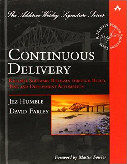
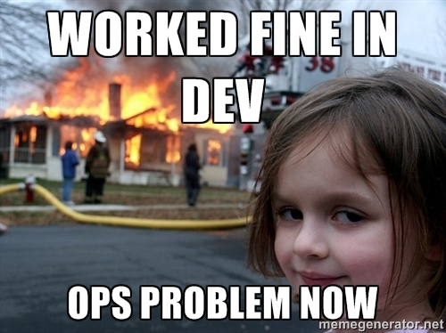
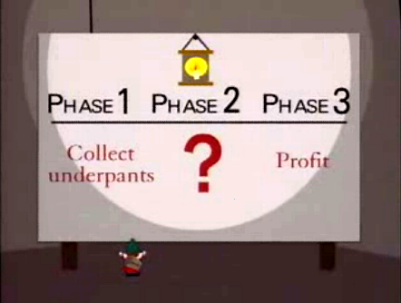

footer: © Matt Curry, 2015
slidenumbers: true

# [fit] Continuous Delivery

---

#Me

Matt Curry [@mattjcurry](http://twitter.com/mattjcurry)
Director of Platform Engineering
AllState Infrastructure Services
[matt.curry@allstate.com](mailto:matt.curry@allstate.com)

---

#What is Continuous Delivery?

> *Continuous Delivery is a software development discipline where you build software in such a way that the software can be released to production at any time.*
-- Martin Fowler

 

> *Reduce the cost, time, and risk of delivering incremental changes to users.*
--Jez Humble

---

# [fit] Who is this Jez Humble Guy?

- Author (Continuous Delivery, Lean Enterprise)
- UC Berkley Lecturer
- VP @ Chef
- Did I mention he wrote the book on Continuous Delivery?  Literally

---

---

# [fit] _**Are**_
# [fit] _You_
# [fit] __*Doing*__
# [fit] __Continuous__ 
# [Fit] __Delivery?__

---

# Jez's Criteria __*FTW*__!

1.) All Engineers are checking into trunk/mainline once per day (No feature branches!)[^1]
 
2.) Every Check-in results in build/unit tests being run.[^1]
 
3.) The build must not be broken for more than 10 minutes at a time.[^1]

[^1]: Jez Humbe - "Adopting Continuous Delivery"

---

^ No one can check in unless someone fixes the build.

^ Everyone stops what they are doing because fixing the tests is the highest priority.

^ The pipeline is the pathway to production and I want to get visibility into that process and understand the status at each level.

^ every change results in a build and every build is a release candidate.

^ the job of the pipeline is to prove that the build is not releasable.

^ Ops should be able to self-service deploy any build candidate with high levels of confidence that it is going to work in production.

---

#Why?

- Increase Quality[^2]
- Reduce Cost[^2]
- Improve Throughput[^2]

- Build the right product for the customer the first time.
- Reduce the risk of experimentation and innovation.

[^2]: Jez Humble - "Adopting Continuous Delivery"

^ Talk about John Allspaw at flickr and when they got aquired by yahoo.  They found that flickr had better uptime than any of yahoos systems.

^ Is it done, or is it done, done?  The only way to get a real feel of project progress is to actually deploy to production.  A milestone can get marked as completed, but then you have security testing, performance testing, etc.

---

---

---

#History Lesson
## Gary Gruver @ HP

- Implemented continuous delivery by accident by applying the Kata method and activity based costing to software development.
- This process started with HP Laserjet firmware, not cool web apps.
- 10 million lines of code
- 400+ developers

---

##HP - The High Level Story

- Build and Integration team took up 15-20% of resources costs.
- Centralized test organization was a key cost driver.
- Marketing was unable to drive features and keep up with the marketplace.
- They could not spend their way out of it.  Costs increased 2.5x over 4 years, but results did not.
- 80-90% of the people were taking existing code and getting it running on all the different devices.

---

##HP - The Key Takeaways

- The only path to success is to have leadership buy-in up front.
- The number of branches is one of the biggest drivers of inefficiency.  Get to one branch with short lived release branches.
- Without a single trunk you have the best process for creating the biggest pile of junk you can imagine.

---

##HP - The Key Takeaways

- Automated testing is a first class citizen.  The build must turn red when they fail.
- High quality tests means that 90% of the time when a test fails, it is a code problem.
- Always protect the integrity of the build.  Auto-revert if build is not fixed within an SLA.
- It is really about increasing the frequency and quality of the feedback to the development organization.

---

---

##HP - The Wins

- Overall development costs reduced by ~40%[^3]
- Programs under development increased by ~140%[^3]
- Development costs per program down 78%[^3]
- Resources aligned to driving innovation increased by 8X[^3]

[^3]: John Gruver - A Practical Approach to Large-Scale Agile Development

---

#The Agile Manifesto

###Principle #1

Our highest priority is to satisfy the customer
through early and continuous delivery
of valuable software.[^4]

[^4]: [http://www.agilemanifesto.org/principles.html](http://www.agilemanifesto.org/principles.html)

---

---

#Value Steam Mapping

- Adopted from lean manufacturing
- It is about value to the customer not value to me.
- Helps us understand the existing process so we know where to start optimizing.
- At the end of the day we want to improve cycle time to deliver value to the customer.
- Need to  understand the roles, time spent at each step, and  value added by those activities.

^ Henry Ford said that if he asked his customers what they want that they would ask for faster horses.

---

#Build Quality In
 

>Cease dependence on mass inspection to achieve quality.  Improve the process and build quality into the process in the first place.
--W. Edwards Deming

^ The cheapest way to fix a bug is to not check it into source control in the first place

^ Quality is not the responsibility of QA and the testers.  It is everyone's responsibility.

---

#Production-ready Software

 

##__*Fast, automated feedback*__ on the __*production readiness*__ of your applications __*every*__ time there is a __*change*__ - to code, infrastructure or configuration. 

---

---

# Desired Outcomes
### How we can measure success

- Reduced cycle time, so that you can deliver value faster
- Reduced defects, so that you can improve efficiency
- Increased predictability of the SDLC to make planning more effective.
- Ability to adopt an attitude of compliance with any regulatory regime.

---

# Desired Outcomes
### How we can measure success

- Ability to determine and manage risks associated with software delivery.
- Reduce costs due to better risk management and fewer issues.

---

#Takeaways

- Understand why you want to change
- Get measurable change fast
- Start with continuous integration on a single master branch
- Focus on organization and architecture
- Create a culture of continuous improvement
- __This crap is Hard, but lots of people are doing it!__

---

# [fit] Questions?

---

#References
1.) Jez Humble - Continuous Delivery - [http://amzn.to/1DSHGu1](http://amzn.to/1DSHGu1)
2.) Jez Humble - "Adopting Continuous Delivery" - [http://bit.ly/1EYu0Uk](http://bit.ly/1EYu0Uk)
3.) Gary Gruver - "A Practical Approach to Large Scale Agile Development" - [http://bit.ly/1rP6nFy](http://bit.ly/1rP6nFy)
4.) Gene Kim - The Phoenix Project - [http://amzn.to/1JhtCOi](http://amzn.to/1JhtCOi)

---

##Image Credits:
- http://memegenerator.net/instance/22605665
- http://devopsreactions.tumblr.com/post/95720939010/the-software-development-life-cycle
- http://blog.valtech.fr/wp-content/uploads/Automation.png

