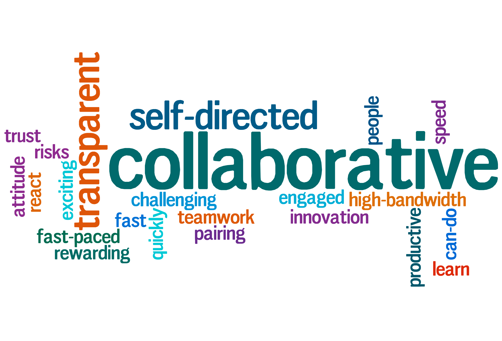

footer: © Matt Curry, 2015
slidenumbers: true
autoscale: true 
theme: Business Class, 1

# [fit] Transformation & Culture
## [fit] 5 keys to situational awareness
#   

##Matt Curry
###Allstate
###[@mattjcurry](http://twitter.com/mattjcurry)

---

---

# [fit] Everyone thinks they want self-service Infrastructure

- PaaS is an answer to a problem
- We want developers focused on problems in our value chain map.
- Self-service infrastructure without broad organizational change is self-defeating

---

> The technology part of this is easy

---

# [fit] Lean Development Principles
1. Eliminate waste
2. Amplified learning
3. Decide as late as possible
4. Deliver as fast as possible
5. Empower the team
6. Build quality in
7. See the whole

---

# Real Estate
## Locations should be focused on removing distractions and fostering learning.

- We want Beer Fridges
- We want ping pong tables
- We want to be where the talent is (More $$ per Sqft)
- We want to provide free food
- We want whiteboards everywhere
- We want open collaboration and community spaces

---

# Human Resources
##We hire for aptitude and collaboration

- We want to hire differently
- We want to deviate from the standard lines of questioning
- We want to hire for aptitude and attitude, not skills
- We want to hire people that will help us build the culture we are trying to create
- We want collaborators and team members instead of rockstars and heros

---

# Legal

- We want to open source the software we write
- We want to use open source everywhere possible.
- We want to contribute back to open source projects, which means we give up the IP.
- We want to make decisions as late as we possibly can.

---

# Culture

What are the 4 words people would use to describe your culture?

- Low Risk vs Calculated Risk
- Process Oriented vs People Oriented
- High Governance vs Freedom with Responsibility

Perception is reality.  Those words are the culture.

---

      Traditional Culture                   Transformed Team

---

     

> The _actual_ company values, as opposed to the _nice-sounding_ values, are shown by who gets rewarded, promoted, or let go
-- [Netflix] (http://www.slideshare.net/reed2001/culture-1798664)

---

# [fit] We Don't Trust our People To do the right thing.

- Decision making is centralized.

- Individuals are afraid to make decisions because changing direction is a major commitment in time and effort.

- Being wrong is viewed as a terrible thing.

---

# "Good" versus "Bad" Process

- **"Good" process helps talented people get more done**
    - Letting others know when you are updating code
    - Spend within budget each quarter so we don't have to coordinate spending decisions across departments
    - Regualrly scheduled strategy and context meetings
- **"Bad" process tries to prevent recoverable mistakes**
	- Get pre-approvals for $5k speding
	- 3 people to sign off on banner ad creative
	- permission needed to hang a poster on a wall
	- multi-level approval process for projects
	- get 10 people to interview each candidate

---

> If you think most of your organization is stupid and lazy, then you are most likely stupid and most certainly lazy.

---

# Culture: Something Different

- Freedom & Responsibility (Netflix)
- Foster Learning & Remove Distractions (Pivotal Labs)
- Transparency & Empowerment (Google)
- Authorship, Responsibility and Transparency (Etsy)
- Openness and Collaboration

---

#[fit]Situational Awareness

The ability to identify, process, and comprehend the critical elements of information about what is happening to the team with regards to the mission. 

---

# #1: Value Chain Mapping

- It is important to map value chains vs evolution [^1]
- We must focus on activities that drive differentiation [^1]
- Doing things because others do them is not a strategy [^2]

[^1]: [http://www.wardleymaps.com/learn.html] (http://www.wardleymaps.com/learn.html)

[^2]: [Introduction to Value Chain Mapping at OSCon] (https://youtu.be/NnFeIt-uaEc)

---

# #2: Empathy

> Most people will not listen until they have been heard.

As engineers we are problem solvers.  We must resist Our natural tendency is to jump in and start solving problems early.  

^Builds a sense of teamwork and a shared desire to tackle a problem.

---

# Empathy through Pairing

- Empathy
- Shared understanding
- Engagement
- Reduces ramp up times
- Drives collaboration
- Creates team cohesion

----

# #3: Collaboration

> Collaboration is vital to sustain what we call profound or really deep change, because without it, organizations are just overwhelmed by the forces of the status quo.
-- Peter Senge

---

# #4: Systems Thinking

We need to focus on outcomes rather than activities.

- Drive understanding of the big picture
- Helps us manage towards sustainable progress
- Requires leadership to manage across silo's.

---

# #5: Organizational Learning

> The only sustainable competitive advantage is an organization's ability to learn faster than the competition.
-- Peter Senge

---

#Summary

There are 5 key ways to build situational awareness to help drive your transformation:

1. Understand the value chain
2. Build empathy across the organization
3. Drive collaboration
4. Use Systems Thinking as a tool to drive change
5. Organizational learning to build sustainable results

---

I should add something about branding the transformation.
